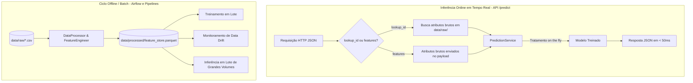

# Runbook de Execução End-to-End — FabricaIA Template
## Guia Operacional Prático para Desenvolvimento, Serving e MLOps

Este documento fornece um guia passo a passo prático para experimentar, executar e reproduzir o ciclo de vida completo entregue pelo template **FabricaIA**, desde o scaffolding inicial e engenharia de dados até o serving em produção com combate ao *training-serving skew*, governança técnica e orquestração contínua de MLOps.

> [!TIP]
> **Compatibilidade Multiplataforma (Linux, macOS e Windows):**  
> Para todos os passos operacionais, apresentamos o comando via **`make`** e a alternativa equivalente em **comando direto** (via `python`, `pip`, `uvicorn`, `airflow`, etc.), garantindo execução transparente no Windows (PowerShell / Prompt de Comando) ou em sistemas que não possuam o utilitário `make` instalado.

---

## 1. O Estudo de Caso: Predição de Risco em Contratos Públicos (ObraAlerta)

Para demonstrar os recursos do template com dados estruturados realistas, utilizamos como estudo de caso a **predição de risco de atraso e paralisação de contratos públicos**:
* **Alvo (`atraso_risco`):** Variável binária (`0` = Em dia / `1` = Alto risco de paralisação ou atraso crítico).
* **Entradas:** Prazos, aditivos contratuais, medição física de execução, porte da empresa e indicadores ambientais/pluviométricos.
* **Objetivo de Negócio:** Permitir a triagem antecipada e a priorização de vistorias técnicas e auditorias preventivas.

---

## 2. Visão Geral do Ciclo de Vida

```text
+-----------------------------------------------------------------------------------------+
|                                  FLUXO END-TO-END                                       |
|                                                                                         |
|  [Scaffolding] ──> [Geração de Dados] ──> [Treino & MLflow] ──> [Serving REST FastAPI]   |
|         │                  │                      │                     │               |
|   Cookiecutter      make data (CSV)         make pipeline        make api (Anti-Skew)   |
|                                                   │                     │               |
|                                           [Airflow MLOps] <─────────────┘               |
|                                          (Drift, Store, Gate)                           |
+-----------------------------------------------------------------------------------------+
```

---

## 3. Passo a Passo Operacional

### Passo 1 — Scaffolding e Configuração do Projeto

Para instanciar um novo projeto derivado do template:
```bash
# Executar assistente interativo de scaffolding
python create_project.py
```
*Ou via linha de comando direta:*
```bash
cookiecutter cookiecutter-fabricaia --no-input \
  project_name="obra_alerta" \
  author_name="Equipe IA" \
  author_email="ia@exemplo.gov.br" \
  python_version="3.11"
```

Acesse o diretório do projeto e configure o ambiente virtual:

#### No Linux / macOS:
```bash
cd obra_alerta

# 1. Crie e ative o ambiente virtual:
python3 -m venv venv
source venv/bin/activate

# 2. Instale as dependências:
# Opção A (com make):
make install       # Instalação padrão
# ou: make setup   # Setup completo com hooks do pre-commit

# Opção B (sem make / direto via pip):
pip install -r requirements.txt
pip install -e .
```

#### No Windows (PowerShell / CMD):
```powershell
cd obra_alerta

# 1. Crie e ative o ambiente virtual:
python -m venv venv
.\venv\Scripts\Activate.ps1   # No PowerShell (ou venv\Scripts\activate.bat no CMD)

# 2. Instale as dependências (sem make):
pip install -r requirements.txt
pip install -e .
```

> [!TIP]
> Se desejar apenas executar o fluxo sem ativar os hooks de validação do git (`pre-commit`), utilize **`make install`** (ou `pip install -r requirements.txt && pip install -e .`). O `make install` instala todas as bibliotecas do projeto, o suporte a testes com `pytest` e registra o pacote em modo editável (`-e .`).

Inspecione o arquivo central de configuração `config/config.yaml`:
```yaml
DATA_PATHS:
  raw: "data/raw"
  processed: "data/processed"
PIPELINE:
  test_size: 0.2
  random_state: 42
MODELS:
  algorithms:
    - "random_forest"
    - "logistic_regression"
    - "svm"
MLFLOW:
  tracking_uri: "sqlite:///mlflow.db"
  experiment_name: "fabricaia_experiments"
  enable_tracking: true
```

---

### Passo 2 — Geração da Base de Dados

Gere uma base sintética calibrada pronta para experimentação:

```bash
# Com Makefile:
make data

# Sem Makefile (Linux, macOS, Windows):
python scripts/generate_dataset.py
```

O arquivo é gerado em `data/raw/obras_publicas.csv` com 500 contratos e as seguintes colunas:
* `id_obra`: Identificador do contrato (ex: `OBR-2024-0001`).
* `tipo_obra`: Categoria da intervenção (`rodovia`, `edificacao`, `saneamento`, `hospitalar`, `educacao`).
* `valor_previsto`: Valor total contratual em R$.
* `prazo_dias`: Duração estipulada em dias.
* `num_aditivos`: Quantidade de termos aditivos de prazo/valor.
* `percentual_executado`: Medição física acumulada (0.05 a 0.95).
* `recurso_federal`: Indicador se recebe repasse federal (0 ou 1).
* `empresa_porte`: Porte da contratada (`pequeno`, `medio`, `grande`).
* `indice_pluviometrico`: Média de chuvas acumulada no período (mm).
* `atraso_risco`: Rótulo de risco (0 ou 1).

---

### Passo 3 — Experiment Tracking com MLflow

#### Opção A — Servidor Local (SQLite na porta 5001)

Inicie o servidor de rastreamento do MLflow:

```bash
# Com Makefile (executa em background no Linux/macOS):
make mlflow-server &

# Sem Makefile (Linux/macOS):
mlflow server --host 0.0.0.0 --port 5001 --backend-store-uri sqlite:///mlflow.db &

# Sem Makefile (Windows PowerShell — executar em um terminal aberto):
mlflow server --host 0.0.0.0 --port 5001 --backend-store-uri sqlite:///mlflow.db
```

> Acesse no navegador: `http://localhost:5001`  
> *(A porta 5001 é utilizada por padrão para evitar conflito com portas reservadas do sistema operacional).*

Para encerrar o servidor MLflow quando terminar:
```bash
# Com Makefile:
make mlflow-stop

# Sem Makefile (Linux/macOS):
pkill -f "mlflow server"

# Sem Makefile (Windows PowerShell):
Get-Process -Name "mlflow" -ErrorAction SilentlyContinue | Stop-Process -Force
```

#### Opção B — Servidor Remoto (com Autenticação HTTP Basic)
Defina as variáveis de ambiente antes de executar o pipeline:

```bash
# Linux / macOS:
export MLFLOW_TRACKING_URI="http://servidor-remoto:5000"
export MLFLOW_TRACKING_USERNAME="seu_usuario"
export MLFLOW_TRACKING_PASSWORD="sua_senha"
```
```powershell
# Windows PowerShell:
$env:MLFLOW_TRACKING_URI = "http://servidor-remoto:5000"
$env:MLFLOW_TRACKING_USERNAME = "seu_usuario"
$env:MLFLOW_TRACKING_PASSWORD = "sua_senha"
```
*As credenciais também podem ser definidas diretamente na seção `MLFLOW:` do `config/config.yaml`.*

---

### Passo 4 — Execução do Pipeline de Treinamento

Execute o pipeline consolidado:

```bash
# Com Makefile:
make pipeline

# Sem Makefile (Linux, macOS, Windows):
python pipelines/scripts/example_pipeline.py
```

O pipeline executa de forma integrada:
1. **Diagnóstico Exploratório:** Gera gráficos de distribuição e correlação salvos em `logs/`.
2. **Tratamento de Dados (`DataProcessor`):** Imputação de nulos, encoding ordinal de categóricas e normalização z-score das variáveis explicativas numéricas (preservando o target discreto para classificação).
3. **Engenharia de Atributos (`FeatureEngineer`):** Criação de variáveis polinomiais e de interação.
4. **Sincronização de Feature Store:** Persistência dos dados tratados e enriquecidos em formato colunar Apache Parquet em `data/processed/feature_store.parquet`.
5. **Treinamento e Validação Cruzada (`ModelTrainer`):** Ajuste dos modelos **Random Forest**, **Regressão Logística** e **SVM** com ciclo de vida de runs do MLflow isolado por algoritmo.
6. **Rastreabilidade e Artefatos:** Registro de parâmetros, acurácia, F1-Score, matrizes de confusão e modelos serializados em `models/trained/*.pkl` e no MLflow.

---

### Passo 5 — Serving REST e Combate ao Training-Serving Skew

Inicie o servidor de inferência com live-reload:

```bash
# Com Makefile:
make api

# Sem Makefile (Linux, macOS, Windows):
python -m uvicorn src.api.main:app --host 0.0.0.0 --port 8000 --reload
```
> Documentação interativa (Swagger UI): `http://localhost:8000/docs`

---

#### 🧠 Arquitetura de Inferência: Online (*On the Fly*) vs. Offline/Batch (*Feature Store & Parquet*)

Uma dúvida frequente em projetos de Machine Learning é: **"A API lê os dados pré-processados de `data/processed/` ou faz o tratamento dos dados brutos em tempo real?"**

No template FabricaIA, adotamos a separação padrão da indústria entre **Serving Online** e **Pipelines Offline**:



1. **A API trata dados brutos *On the Fly* (em tempo de execução):**
   * Em produção, uma requisição online para `/predict` frequentemente submete os dados de um contrato **novo** (acabado de licitar), que **não existe previamente** em `data/processed/` nem no Feature Store.
   * Por isso, a camada [`PredictionService`](file:///home/euclydes/repos/fia/Template/src/services/prediction_service.py) recebe os atributos brutos, aplica a limpeza, codificação categórica, escalonamento, gera as variáveis polinomiais/interações e alinha estritamente as colunas com `model.feature_names_in_`.
   * **Vantagem (Zero Skew):** Como o `PredictionService` reaproveita os mesmos módulos do treino (`DataProcessor` e `FeatureEngineer`), garante-se que a fórmula de cálculo na inferência é **100% idêntica** à do treinamento, eliminando o *Training-Serving Skew*.

2. **Qual é, então, o papel de `data/processed/` e do `feature_store.parquet`?**
   * **Treinamento e Retreinamento em Lote (*Batch Training*):** A esteira do Airflow e o script `example_pipeline.py` consom o arquivo Parquet colunar para treinar, validar e comparar múltiplos modelos com alto desempenho de leitura em disco.
   * **Inferência em Lote (*Batch Scoring*):** Para jobs agendados que precisam escorar dezenas de milhares de obras periodicamente (ex.: auditoria noturna), o Airflow pode ler diretamente o Parquet já pré-calculado, evitando reprocessar atributos cru linha por linha.
   * **Detecção de *Data Drift*:** O arquivo Parquet serve de histórico e baseline estatístico para avaliar se as médias e variâncias das features estão sofrendo deriva ao longo do tempo.

---

#### Exemplos de Consulta à API

##### A. Inferência por Lookup de Instância (Zero Skew)
O cliente informa apenas o identificador da obra. A API busca o registro bruto e executa todo o pré-processamento antes de consultar o modelo:
```bash
curl -X POST "http://localhost:8000/predict" \
  -H "Content-Type: application/json" \
  -d '{
    "lookup_id": "OBR-2024-0001",
    "model_name": "random_forest"
  }'
```
*Resposta esperada (JSON):*
```json
{
  "prediction": 1,
  "probability": {
    "0": 0.27,
    "1": 0.73
  },
  "model_name": "random_forest",
  "confidence": 0.73,
  "lookup_id": "OBR-2024-0001",
  "raw_input_summary": {
    "id_obra": "OBR-2024-0001",
    "tipo_obra": "hospitalar",
    "valor_previsto": 5101998.49,
    "prazo_dias": 440,
    "num_aditivos": 5,
    "percentual_executado": 0.41,
    "empresa_porte": "grande"
  }
}
```

##### B. Inferência com Atributos Brutos
Permite submeter os dados de um contrato novo diretamente no payload JSON:
```bash
curl -X POST "http://localhost:8000/predict" \
  -H "Content-Type: application/json" \
  -d '{
    "model_name": "random_forest",
    "features": {
      "tipo_obra": "rodovia",
      "valor_previsto": 1500000.0,
      "prazo_dias": 365,
      "num_aditivos": 2,
      "percentual_executado": 0.40,
      "recurso_federal": 1,
      "empresa_porte": "grande",
      "indice_pluviometrico": 120.0
    }
  }'
```

##### C. Inferência em Lote via Planilha CSV
Para classificar grandes volumes de contratos em lote via upload multipart:
```bash
curl -X POST "http://localhost:8000/predict_batch?model_name=random_forest" \
  -F "file=@data/raw/obras_publicas.csv"
```

---

### Passo 6 — Orquestração Contínua de MLOps com Apache Airflow

O arquivo `pipelines/dags/fabricaia_pipeline_dag.py` modela a esteira contínua completa:

```text
load_and_explore_data
        ↓
check_data_drift          (Compara lote atual com histórico e avalia desvio estatístico)
        ↓
preprocess_data & engineer_features
        ↓
sync_feature_store        (Exporta dados consolidados para data/processed/feature_store.parquet)
        ↓
train_models & evaluate_models  (Isolamento de runs MLflow por algoritmo)
        ↓
promote_production_model  (Quality Gate: se acurácia >= 0.75, promove para production_model.pkl)
        ↓
cleanup_temp_files        (Limpeza segura de arquivos temporários do usuário)
```

#### Inicialização e Execução do Airflow

##### Com Makefile (Linux / macOS):
```bash
make airflow-init          # Inicializa banco, cria usuário admin e linka DAGs
make airflow-webserver     # No Airflow 3 executa api-server; no Airflow 2 executa webserver
# Em outro terminal:
make airflow-scheduler     # Dispara o agendador de tarefas
```
*Atalho all-in-one:*
```bash
make airflow-standalone    # Sobe banco, api-server e scheduler em um único processo
```
*Para parar:*
```bash
make airflow-stop
```

##### Sem Makefile no Linux / macOS:
```bash
# 1. Preparar pastas e link simbólico para as DAGs
mkdir -p ~/airflow/dags
ln -sfn $(pwd)/pipelines/dags ~/airflow/dags

# 2. Inicializar banco e criar usuário
airflow db migrate
airflow users create --username admin --firstname Admin --lastname User --role Admin --email admin@example.com --password admin
airflow dags reserialize

# 3. Executar o servidor e o scheduler:
airflow api-server --port 8080   # Em um terminal (ou: airflow webserver --port 8080 no Airflow 2)
airflow scheduler                # Em outro terminal
```

##### Sem Makefile no Windows (PowerShell):
```powershell
$env:AIRFLOW_HOME = if ($env:AIRFLOW_HOME) { $env:AIRFLOW_HOME } else { "$HOME\airflow" }
New-Item -ItemType Directory -Force -Path "$env:AIRFLOW_HOME\dags"
New-Item -ItemType SymbolicLink -Path "$env:AIRFLOW_HOME\dags\pipelines_dags" -Target "$PWD\pipelines\dags"

airflow db migrate
airflow users create --username admin --firstname Admin --lastname User --role Admin --email admin@example.com --password admin
airflow dags reserialize

# Executar serviços (em terminais separados):
airflow api-server --port 8080
airflow scheduler
```

> Acesse a interface web em `http://localhost:8080` (usuário: **`admin`** / senha: **`admin`**).

> [!NOTE]
> **Observação sobre a Visualização de Logs na UI vs. Execução de Teste (`airflow dags test`):**  
> Se você testar a DAG pela linha de comando (`airflow dags test fabricaia_ml_pipeline`), a saída é impressa diretamente no terminal. Ao clicar na aba **Logs** de uma tarefa na interface web, pode surgir a mensagem `Could not read served logs: ... Connection refused on port 8793`.  
> Isso **não** é uma falha da tarefa: o Airflow apenas tenta contatar um servidor de logs distribuído (porta 8793) inexistente em ambiente local. O status de sucesso é visível em **Task Instance Details** e os artefatos retornados em **XCom**. Quando a DAG é disparada normalmente pelo **Scheduler**, os logs são persistidos em disco (`~/airflow/logs/`) e renderizados perfeitamente na interface.

---

### Passo 7 — Qualidade de Software, Testes e Linters

Execute a suíte automatizada de testes com medição de cobertura de código:

```bash
# Com Makefile:
make test

# Sem Makefile (Linux, macOS, Windows):
pytest tests/ -v --cov=src --cov-report=term-missing --cov-report=html
```

Validação estática e formatação:

```bash
# Linters estáticos (flake8 e mypy):
make lint
# Sem make:
flake8 src/ tests/ && mypy src/

# Formatação automática de código (black e isort):
make format
# Sem make:
black src/ tests/ && isort src/ tests/

# Validação com todos os hooks do pre-commit:
make precommit
# Sem make:
pre-commit run --all-files
```

---

### Passo 8 — Containerização com Docker e Docker Compose

Construa e execute a imagem padronizada do projeto:

```bash
# Com Makefile:
make docker-build
make docker-run

# Sem Makefile (Linux, macOS, Windows):
docker build -t fabricaia .
docker run -p 8000:8000 -p 5001:5001 fabricaia
```

Para orquestrar múltiplos serviços simultaneamente (API FastAPI, Jupyter e Airflow):

```bash
# Iniciar serviços em segundo plano:
docker compose up -d       # ou: docker-compose up -d

# Visualizar status dos contêineres:
docker compose ps

# Parar serviços:
docker compose down
```

---

### Passo 9 — Governança e Auditoria Técnica

Para garantir conformidade regulatória, rastreabilidade e explicabilidade exigidas em auditorias e diretrizes éticas de IA, o template disponibiliza artefatos padronizados na pasta `docs/`:

1. **[`docs/MODEL_CARD.md`](MODEL_CARD.md):**  
   Ficha de governança técnica do modelo inspirada no padrão de Mitchell et al. (2019). Formaliza a finalidade pretendida, casos de uso fora de escopo, métricas mínimas aceitáveis no Quality Gate, limiares de decisão e diretrizes de supervisão humana (*Human-in-the-Loop*).
2. **[`docs/DATA_SHEET.md`](DATA_SHEET.md):**  
   Ficha técnica do dataset baseada no padrão de Gebru et al. (2021). Documenta a composição das variáveis, procedimentos de amostragem estocástica, ausência de dados sensíveis ou pessoais (PII) e estratégias de monitoramento contra *data drift*.
3. **Rastreabilidade Contínua de Artefatos:**  
   * **MLflow:** Cada execução de treino registra hashes do modelo, hiperparâmetros, gráficos de matriz de confusão e métricas de validação cruzada.
   * **Airflow Quality Gate:** O passo `promote_production_model` audita a métrica de acurácia antes de substituir o arquivo `models/trained/production_model.pkl`, prevenindo regressões de performance em produção.

---

## 4. Guia Rápido de Comandos (Cheatsheet)

| Objetivo | Com Makefile | Sem Makefile (Linux / macOS) | Sem Makefile (Windows PowerShell) |
| :--- | :--- | :--- | :--- |
| **Instalação Padrão** | `make install` | `pip install -r requirements.txt && pip install -e .` | `pip install -r requirements.txt; pip install -e .` |
| **Setup Completo (com pre-commit)** | `make setup` | `pip install -r requirements.txt && pip install -e . && pre-commit install` | `pip install -r requirements.txt; pip install -e .; pre-commit install` |
| **Gerar Base de Dados** | `make data` | `python scripts/generate_dataset.py` | `python scripts/generate_dataset.py` |
| **Subir MLflow Local** | `make mlflow-server &` | `mlflow server --host 0.0.0.0 --port 5001 --backend-store-uri sqlite:///mlflow.db &` | `mlflow server --host 0.0.0.0 --port 5001 --backend-store-uri sqlite:///mlflow.db` |
| **Parar MLflow Local** | `make mlflow-stop` | `pkill -f "mlflow server"` | `Get-Process mlflow -ErrorAction SilentlyContinue \| Stop-Process -Force` |
| **Executar Pipeline de ML** | `make pipeline` | `python pipelines/scripts/example_pipeline.py` | `python pipelines/scripts/example_pipeline.py` |
| **Subir API REST FastAPI** | `make api` | `python -m uvicorn src.api.main:app --host 0.0.0.0 --port 8000 --reload` | `python -m uvicorn src.api.main:app --host 0.0.0.0 --port 8000 --reload` |
| **Inicializar Airflow** | `make airflow-init` | `airflow db migrate && airflow users create ...` | `airflow db migrate; airflow users create ...` |
| **Subir Airflow Server** | `make airflow-webserver` | `airflow api-server --port 8080` | `airflow api-server --port 8080` |
| **Subir Airflow Scheduler** | `make airflow-scheduler` | `airflow scheduler` | `airflow scheduler` |
| **Subir Airflow Standalone** | `make airflow-standalone` | `airflow standalone` | `airflow standalone` |
| **Parar Serviços Airflow** | `make airflow-stop` | `pkill -f "airflow (webserver\|api-server\|scheduler\|standalone)"` | `Get-Process *airflow* \| Stop-Process -Force` |
| **Executar Testes Unitários** | `make test` | `pytest tests/ -v --cov=src` | `pytest tests/ -v --cov=src` |
| **Análise Estática (Linters)** | `make lint` | `flake8 src/ tests/ && mypy src/` | `flake8 src/ tests/; mypy src/` |
| **Formatação Automática** | `make format` | `black src/ tests/ && isort src/ tests/` | `black src/ tests/; isort src/ tests/` |
| **Build Docker** | `make docker-build` | `docker build -t fabricaia .` | `docker build -t fabricaia .` |
| **Executar Contêiner Docker** | `make docker-run` | `docker run -p 8000:8000 -p 5001:5001 fabricaia` | `docker run -p 8000:8000 -p 5001:5001 fabricaia` |
| **Subir Docker Compose** | `docker compose up -d` | `docker compose up -d` | `docker compose up -d` |
| **Limpar Temporários** | `make clean` | `find . -type f -name "*.pyc" -delete && rm -rf build/ dist/ .pytest_cache/` | `Get-ChildItem -Include *.pyc, __pycache__, build, dist -Recurse \| Remove-Item -Recurse -Force` |

---

## 5. Troubleshooting (Resolução de Problemas Comuns)

| Sintoma | Causa Provável | Solução |
| :--- | :--- | :--- |
| `Command 'make' not found` | Utilitário `make` não instalado no sistema operacional | No Linux (Ubuntu/Debian): `sudo apt install -y make`. No Windows ou em ambientes sem `make`, use os comandos diretos da coluna **"Sem Makefile"** na tabela acima. |
| `Could not read served logs ... Connection refused on port 8793` | Visualização de logs na UI após execução manual com `airflow dags test` | Comportamento normal em testes locais via CLI: os logs foram emitidos no próprio terminal. Na UI, confira o status em **Task Instance Details** e os retornos em **XCom**. Em execuções via Scheduler, os logs são persistidos em disco. |
| `Address already in use: 5000` | Porta 5000 ocupada por outro serviço local | O Makefile e as configurações utilizam a porta **5001**: `make mlflow-server` ou `mlflow server --port 5001 ...`. |
| `ModuleNotFoundError: No module named 'src.services'` | Pacote do projeto não instalado no modo editável | Execute `pip install -e .` na raiz do projeto dentro do ambiente virtual. |
| `Changing param values is not allowed` no MLflow | Execuções concorrentes sem encerramento de run | Assegure que cada modelo feche explicitamente o ciclo de vida da run com `tracker.end_run()`. |
| `ValueError: Unknown label type: continuous` | Normalização numérica aplicada indevidamente sobre a coluna alvo | O pipeline e o `PredictionService` excluem automaticamente a coluna target da etapa `scale_features`. |
| `airflow db init: invalid choice` | Comando legado do Airflow 1/2.6 em versão moderna | No Airflow 2.7+ e Airflow 3 utilize `airflow db migrate` (já configurado no `make airflow-init`). |
| `Command airflow webserver has been removed` | Airflow 3 substituiu o webserver pelo `api-server` | Utilize `airflow api-server --port 8080` (já tratado automaticamente no `make airflow-webserver`). |
